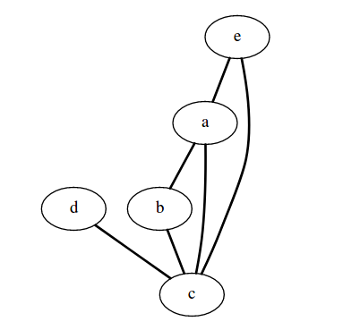

# gatsby-remark-draw

A wrapper around some popular graph tools to generate diagrams from ebedded code blocks in Markdown.

This package currently supports:

* [SvgBobRus][bobrus] for ASCII diagrams 
* [GraphViz][graphviz] for diagrams expressed in dot 

This package uses a simple (naive) mechanism - read the code block, pass it over stdin to the selected process, and replace the current code block with the generated SVG wrapped in a div.

In order to avoid conflicts with syntax highligters the language is postfixed with "-svg".

## Usage

```bash
npm install gatsby-remark-draw --save
```


In your `gatsby-config.js` add this plugin under the `gatsby-transformer-remark` plugin:

```json
resolve: "gatsby-transformer-remark",
      options: {
        plugins: [
          "gatsby-remark-svgbob"
        ]
      }
// ...
```


It is important to add this plugin **before** any other plugin that processes code blocks like `gatsby-remark-prismjs`.

### Diagrams 

#### SvgBobRus diagrams

This package expects svgbob_cli to available in the system path.  Installation: 

`cargo install svgbob_cli`

You can find specific instructions on the [repo page][bobrus].

In Markdown you can use a normal code-block with language set to "bob-svg":

\`\`\`bob-svg
   .------.

  |      |

  |  A   |

  |      |

  '------'

​     |

​     |

​     *

  +------+

  |      |

  |  B   |---.

  |      |    \

  +------+     '----->  Hello
\`\`\`

Which will provide the following (rendered) inline SVG diagram:


#### Graphviz

Graphviz can be installed in most cases via your package manager.  See the [download page][graphviz-download] for manual downloads and installation instruction instructions.

In Markdown you can use a normal code-block with language set to "dot-svg" which will use the dot engine to produce the image:

\`\`\`dot-svg
graph {
    a -- b;
    b -- c;
    a -- c;
    d -- c;
    e -- c;
    e -- a;
}
\`\`\`

will provide the following (rendered) inline SVG diagram:




[bobrus]: https://github.com/ivanceras/svgbobrus
[graphviz]: https://www.graphviz.org/
[graphviz-download]: https://www.graphviz.org/download/