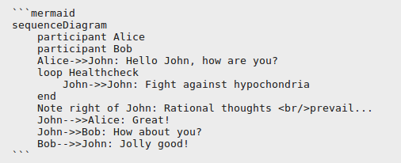
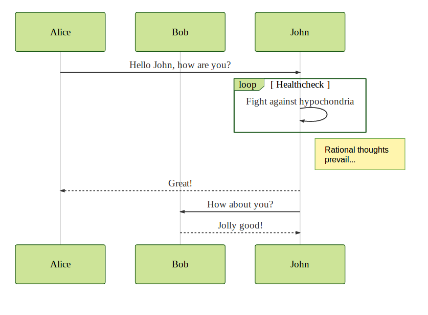

# gatsby-remark-draw

[](https://badge.fury.io/js/gatsby-remark-draw) [](https://travis-ci.org/rhanekom/gatsby-remark-draw) [](https://codeclimate.com/github/rhanekom/gatsby-remark-draw/maintainability) 

A wrapper around some popular graph tools to generate diagrams from embedded code blocks in Markdown with Gatsby.js and Remark.

This package currently supports:

-   [SvgBobRus][bobrus] for ASCII diagrams
-   [GraphViz][graphviz] for diagrams expressed in dot
-   [Mermaid][mermaid] for diagrams and flowcharts

TODO:

-   ~~Enable options to be passed to executables~~
-   ~~Mermaid support~~
-   ~~Other GraphViz layout engines like `neato`~~
-   ~~Embed as img tag option~~
-   Tranform links to graph files

This package uses a simple (naive) mechanism - by default, read the code block, pass it the selected process and replace the current code block with the generated SVG wrapped in a div.  For styling purposes the class names are the following:

-   `remark-draw`
-   `remark-draw-dot` (for GraphViz graphs)
-   `remark-draw-svgbob` (for SvgBobRus graphs)

In order to avoid conflicts with syntax highligters the language is postfixed with "-svg".

To rather write the files to disk and replace the code block with an `` tag you can specify the `strategy: img` option inside `options`.  The generated SVG files will be written to the `public` directory and linked from there.  For styling purposes the generated image title starts with `remark-draw`.

## Usage

```bash
npm install gatsby-remark-draw --save
```

In your `gatsby-config.js` add this plugin under the `gatsby-transformer-remark` plugin:

```json
resolve: "gatsby-transformer-remark",
      options: {
		"strategy": "img",
        "plugins": [
          "gatsby-remark-draw"
        ]
      }
// ...
```

It's important to add this plugin **before** any other plugin that processes code blocks like `gatsby-remark-prismjs`.

Since v1.0.8 options can now be passed through to the rendering engine to change default settings.  For example,

```json
resolve: 'gatsby-remark-draw',
	options: {
		dot: {
			edgeAttributes: {
				'arrowtail': 'empty',
				'arrowhead': 'empty'
			}
		},
		bob: {
			fontFamily: 'verdana'
		},
		mermaid: {
			theme: 'forest'
		}
	}
}
```

Please see the [Skyrta documentation][skyrta] for details on the options available.

### Diagrams

#### SvgBobRus diagrams

This package expects svgbob_cli to available in the system path.  Installation:

`cargo install svgbob_cli`

You can find specific instructions on the [repo page][bobrus].

In Markdown you can use a normal code-block with language set to "bob-svg":


Which will provide the following (rendered) inline SVG diagram:


#### Graphviz

Graphviz can be installed in most cases via your package manager.  See the [download page][graphviz-download] for manual downloads and installation instruction instructions.

In Markdown you can use a normal code-block with language set to "dot-svg" which will use the dot engine to produce the image:


will provide the following (rendered) inline SVG diagram:


#### Mermaid

To render [Mermaid][mermaid] graphs you need to install both the mermaid and the cli packages:

```bash
npm install mermaid mermaid.cli --save
```

Note the `.` in the cli package name - the package with a `-` that shall not be named here has been deprecated.

A sample flowchart from the main [Mermaid][mermaid] repository:



will provide the following (rendered) SVG diagram:




## Demo

Demos can be found [here](https://rhanekom.github.io/gatsby-remark-draw-demo/).

[bobrus]: https://github.com/ivanceras/svgbobrus

[graphviz]: https://www.graphviz.org/

[graphviz-download]: https://www.graphviz.org/download/

[skyrta]: https://github.com/rhanekom/skyrta

[mermaid]: https://github.com/knsv/mermaid

